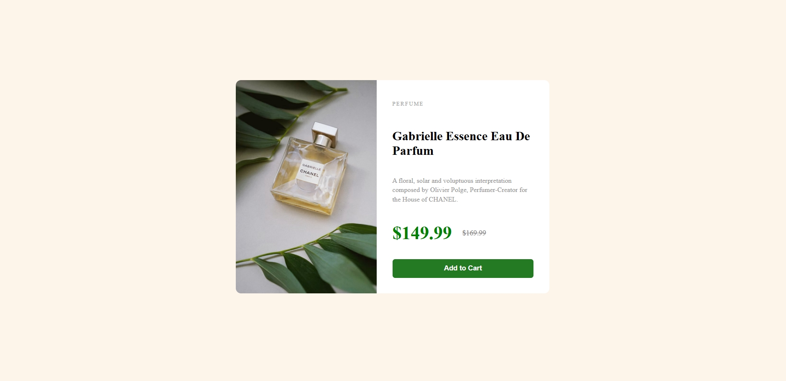

Product Preview Card Component 🌸

A modern, responsive product preview card built with HTML and CSS.
This component showcases a product with a clean design, highlighting key information like name, description, price, and a call-to-action button.

About 📝

This project is a product card UI component inspired by modern e-commerce designs.
It demonstrates responsive layout skills using Flexbox, clean typography, and styling best practices.

Perfect for portfolios or as a reusable component in e-commerce websites.

Demo 🎬

Live demo:
[View Demo](https://anile7.github.io/product-preview-card/)

Screenshot:

Features ✨
- Responsive design for desktop and mobile
- Clean and minimal UI/UX
- Fully customizable layout and colors

Technologies 🛠️
- HTML5
- CSS3 (Flexbox, Media Queries)
 

Acknowledgements 🙏
- This design is inspired by a challenge from [Frontend Mentor](https://www.frontendmentor.io).
